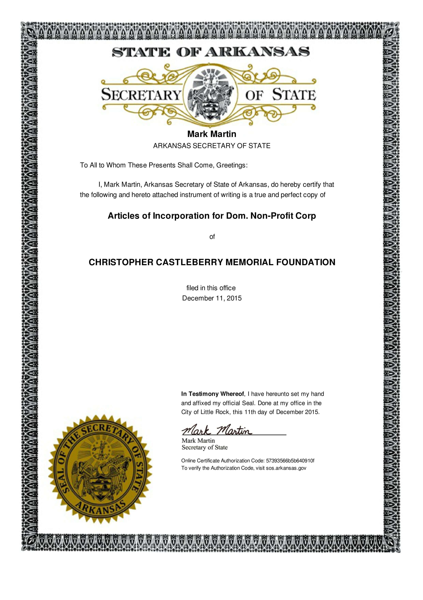

### Fountain Lake
2012 Christian Crumpton $1000 UCA (unknown) 
2013 Joseph Newman $1000 HSU (graduated) 
2014 Ambrosia Roach $1000 HSU (graduated) 
2015 Sarah Rountree $1000 ASU (graduated) 
2016 Kevin Collins $1000 OBU (unknown) 
2017 Alina Rudakova $500 HSU (in school) 
2018 Chloe Chapman $500 UCA (did not graduate) 
2019 Dylan Wasson $1500 UCA (in school) 
2020 Jake Turner $1000 NPC (in school) 
###### Total so far: $8500

### Henderson School of Business 
2016 - Abbey Nivens $750 
2017 - Bailey Thomas $750 
2018 - Nicholas Robertson $750 
2019 - Brian Jarrett $2500 
2019 - Erika Emmons $2500 
2020 - Wade Tubbs $2000 
2020 - Leonia Partian $2000 
2021-Monica Tedford $2,000 

###### Total $13,250 so far

### Grand Total $21,750
